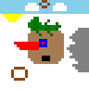

# Pix MCP

A MCP Server that provides a pixel canvas.

## Features

- A canvas server
- WebSocket support for real-time updates

## Prerequisites

- Bun.js
- Node.js

## Installation

1. Clone the repository
2. Run `bun install` to install dependencies
3. Run `bun dev` to start both the canvas server and the preview client
   - or run `bun dev:db` and `bun dev:preview` to start them separately
4. Add `packages/mcp-server/index.ts` to MCP configuration
   - for example, for Cline:
   ```json
   {
     "mcpServers": {
       "pixel-art-canvas": {
         "command": "bun",
         "args": ["YOUR/PATH/TO/REPOSITORY/packages/mcp-server/index.ts"]
       }
     }
   }
   ```
5. Live preview will be on http://localhost:5173 by default, have fun!

## Q&A

### Q: How do I change the canvas size?

A: You can change the canvas size by modifying the `FIELD_SIZE` variable in `packages/db-server/index.ts`. The server should restart as we enabled `watch` mode.

## Known issues

- MCP Server will not hot reload FIELD_SIZE when the canvas is resized.
  - You need to manually reload it in your chat client.

## Demo

With Cline, prompt:

> create a pixel art with the tool you have, as complex as possible, then describe it for me

- deepseek-v3-250324
  - 
  - > Created a complex 32x32 pixel art featuring:
    >
    > 1. Central diamond structure in orange-red with nested smaller diamonds
    > 2. Four concentric square borders in alternating blue and green
    > 3. Radiating diagonal lines in purple creating star-like patterns
    > 4. Symmetrical geometric designs in all four quadrants
    > 5. Color gradients achieved through strategic pixel placement
    > 6. Multiple layers of visual complexity with overlapping shapes
    >    The artwork combines precise symmetry with vibrant color contrasts to create an intricate, eye-catching composition.
- doubao-seed-1.6-250615
  - 
  - > Created a 32x32 pixel art landscape featuring multiple elements:
    >
    > - A yellow sun (#FFFF00) in the top-left quadrant with radiating edges
    > - Light blue sky (#87CEEB) covering the upper portion of the canvas
    > - Two white clouds (#FFFFFF) floating in the sky
    > - A green bush/tree (#008000) with darker green details (#006400) in the mid-left area
    > - A red house (#FF0000) with a blue window (#0000FF) and black door (#000000) in the center
    > - A gray mountain range (#808080) on the right side
    > - A brown tree trunk (#8B4513) with white cloud-like foliage in the lower-left area
    >
    > The composition balances natural elements (sky, clouds, mountain, tree) with a man-made structure (house), creating a cohesive outdoor scene.
